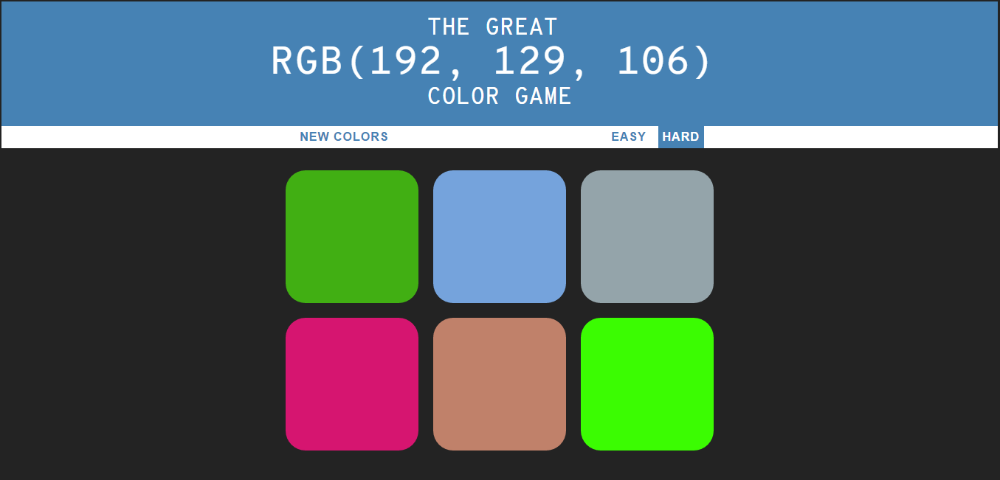
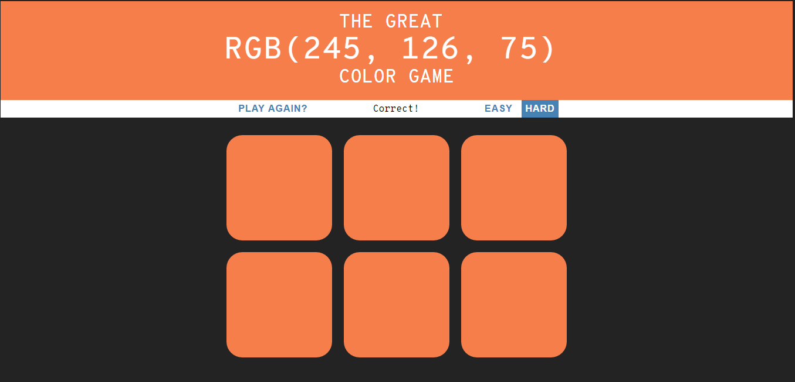

# rgbGame
I've made this game as a part of a udemy course.

### Gameplay
In this color game you are given a RGB value and you must select the correct color square. Very simple, but is actually quite fun.
Find more about [RGB](https://en.wikipedia.org/wiki/RGB_color_model) on wikipedia.

